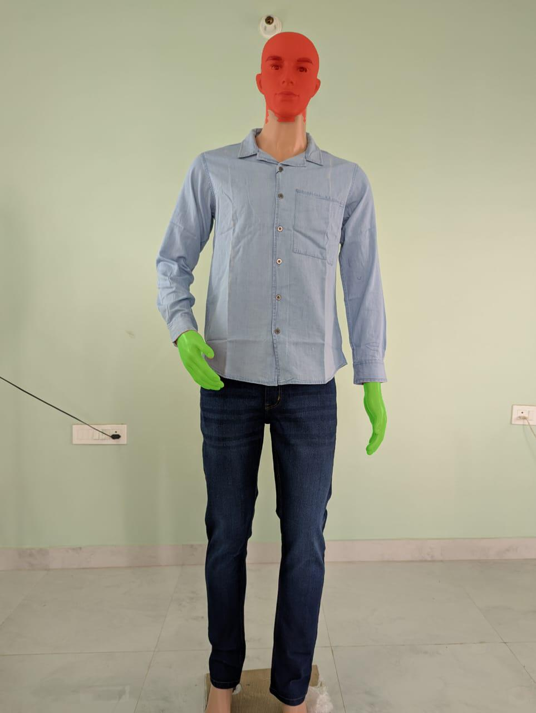

 🧠 Face & Hand Segmentation using SAM (Segment Anything Model)

Automatically detect and segment **faces and hands** in any image using:
- 🧑‍🦰 Face detection (OpenCV DNN)
- ✋ Hand detection (MediaPipe)
- 🎯 Segmentation using Meta AI’s **SAM (Segment Anything Model)**
- 🎨 Visual output with overlaid masks
- 🌐 Simple Gradio Web App

---

## 📸 Sample Output



---

## 🚀 Features

- ✅ Automatic face & hand detection (no manual input!)
- ✅ SAM-based segmentation (local model, no API needed)
- ✅ Mask visualization and save
- ✅ Gradio UI for interactive use
- ✅ Fully offline pipeline

---

## 🛠️ Setup Instructions

### 1. Clone this repo

```bash
git clone https://github.com/Siddhesh-Mundhe/Hand_Face_Segmentation.git
cd Hand_Face_Segmentation
2. Create virtual environment
bash
Copy
Edit
python -m venv venv
venv\Scripts\activate  # On Windows
3. Install dependencies
bash
Copy
Edit
pip install -r requirements.txt
4. Download SAM weights
Manually download this model checkpoint (due to GitHub limits):

🔗 sam_vit_b_01ec64.pth

Place it inside the models/ directory.

5. Run the app
bash
Copy
Edit
python app.py
The app will launch in a browser via Gradio.

🧠 How It Works
Step	Description
🧍 1. Load image	Load any JPEG/PNG
👁️ 2. Detect	Detect face via OpenCV and hands via MediaPipe
✂️ 3. Segment	Use SAM to segment the bounding boxes
🖌️ 4. Visualize	Masks are overlaid on the image
🌐 5. App	Simple Gradio interface for input/output

📁 Project Structure
pgsql
Copy
Edit
.
├── app.py                  # Gradio UI
├── main.py                 # Core pipeline logic
├── detectors/              # Face and hand detectors
├── sam2_api/               # SAM segmentation logic (local)
├── utils/                  # Visualization tools
├── models/                 # Face detector + SAM checkpoint
├── samples/                # Sample input/output images
├── requirements.txt
└── README.md


📌 Limitations
Only supports static images (no webcam/live feed)

Accuracy depends on detection confidence

Segmentation might fail on occluded or low-quality images

✨ Future Ideas
Add webcam-based input

Extend to other body parts

Streamlit/Flask web hosting

🤝 Credits
Meta AI — Segment Anything

OpenCV — Face Detection

Google MediaPipe — Hand Landmarks

Gradio — Web UI

📜 License
MIT License — feel free to use and modify.

yaml
Copy
Edit 
